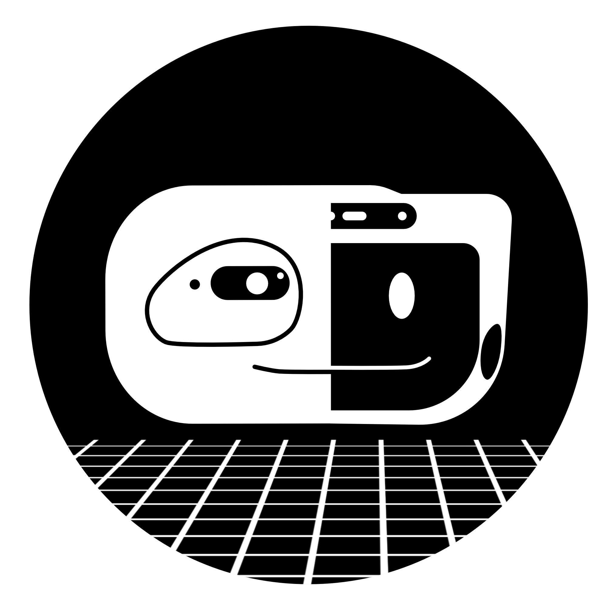
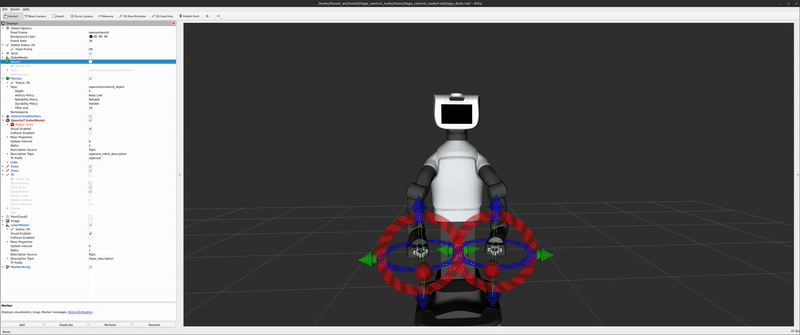

# tiago_wbc_ros2 🤖

<p align="center">
  
</p>

A minimal ROS 2 whole-body control demo for the TIAGo robot.

## Getting Started

### 1. Clone the repository

Clone the repository and initialize its submodules:

```bash
git clone https://github.com/hucebot/tiago_wbc_ros2.git
cd tiago_wbc_ros2
git submodule update --init --recursive
```

### 2. Configure the environment

Create a `.env` file from the provided template:

```bash
cp .env.template .env
```

Then edit `.env` and set the `DDS_ENV` variable:

- `local` — for local testing (recommended for the demo)
- `robot` — to connect to the real robot

### 3. Build the Docker image

Build the deployment image (this may take around 40 minutes the first time):

```bash
make build-deploy
```

### 4. Launch the demo

Start the Docker container:

```bash
make deploy
```

After a few moments, **RViz** should open and display the TIAGo robot model. You can interact with the robot by dragging the interactive markers in RViz, as shown in the demo video below.


---

## Coming Soon

Documentation for running the controller on the real TIAGo robot will be added soon.
