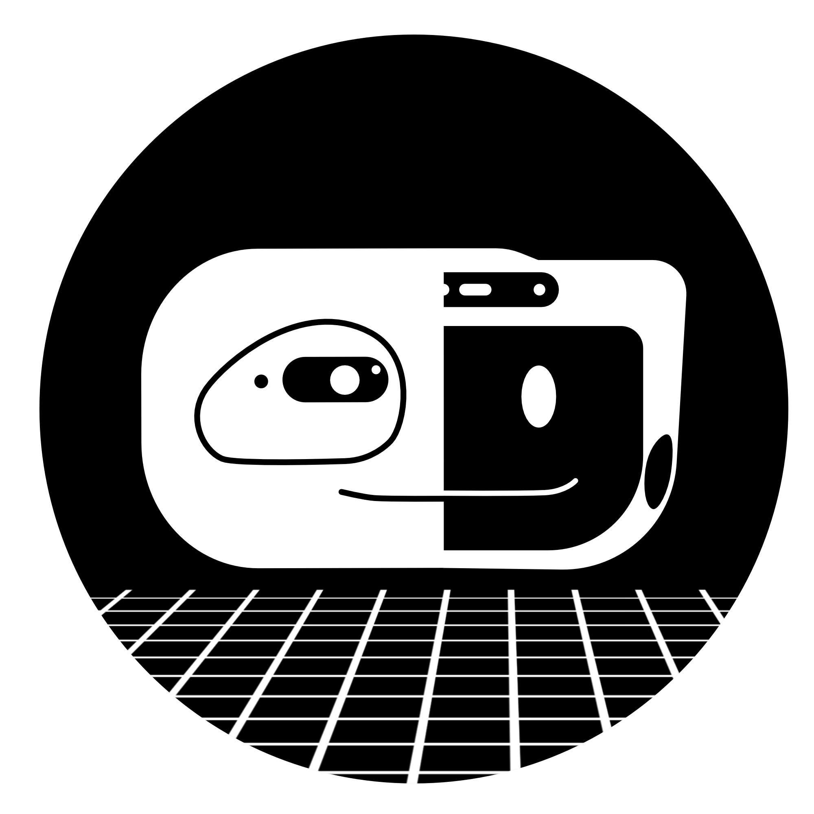
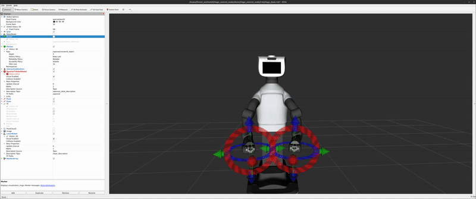

# tiago_wbc_ros2 🤖

<p align="center">
  
</p>

A minimal ROS 2 whole-body control demo for the **TIAGo** and **TIAGo Pro** robots,
built on [OpenSoT](https://github.com/hucebot/OpenSoT). It runs a hierarchical QP
that tracks Cartesian goals for both grippers and a base velocity command while
respecting joint / velocity limits and self-collision avoidance. You drive it from
RViz interactive markers (or a joystick, or replay).



> TIAGo Pro is the primary, most-tested target. Original-TIAGo (dual) support is
> maintained best-effort and shares the same code path.

---

## Requirements

- Docker with the Compose plugin (`docker compose`)
- An X server on the host (for RViz). NVIDIA GPU optional.
- `make`

---

## 1. Get the code

```bash
git clone https://github.com/hucebot/tiago_wbc_ros2.git
cd tiago_wbc_ros2
git submodule update --init --recursive
```

## 2. Configure the environment

```bash
cp .env.template .env
```

`.env` holds `DDS_ENV`:

| value   | use                                             |
|---------|-------------------------------------------------|
| `local` | local testing / the demo (loopback DDS) — default |
| `robot` | connect to a real robot over the network        |

## 3. Build the image

```bash
make build-deploy
```

The heavy dependency stack (ROS 2 + Pinocchio + xbot2_interface + OpenSoT + QP
solvers + PAL descriptions) ships in a prebuilt base image, so the first run
mostly pulls that base (large, one-off) and then builds only `tiago_control_node`
on top — a couple of minutes, not the old ~40. The base image recipe lives in
[.ci/Dockerfile.base](.ci/Dockerfile.base).

## 4. Run the demo

Pick the robot:

```bash
make tiago-pro     # TIAGo Pro
make tiago         # original TIAGo (dual)
```

Both start the same stack (`docker compose up opensot_deploy`) with
`robot_model:=pro` / `robot_model:=dual`. After a few seconds **RViz** opens with
the robot model; drag the two interactive markers to move the grippers.

`make deploy` is the plain form — it obeys `ROBOT_MODEL` if you export it yourself
(defaults to `pro`).

Need a shell in the running container? `make shell` — it re-runs the entrypoint so
you get the full ROS env (`docker exec … bash` alone skips it and misses
`CYCLONEDDS_URI` / the sourced workspaces).

Stop everything with `make down`.

---

## Using the demo

The app nodes run under a **namespace** (`tiago_pro` for `make tiago-pro`, `tiago`
for `make tiago`), so the examples below are prefixed accordingly. Override it with
`namespace:=…` on the launch.

- **Move an arm** — drag the `left` / `right` interactive marker in RViz. Use the
  marker's right-click menu to enable/disable or reset a task.
- **Home the robot** — call one of the `home_position/<name>` services
  (e.g. `ros2 service call /tiago_pro/home_position/home std_srvs/srv/Trigger`).
  Named configs live in
  [config/home_poses.yaml](src/tiago_control_node/config/home_poses.yaml); the
  solver interpolates to them collision-safely and publishes
  `/tiago_pro/opensot/home_done`.
- **Drive the base** — publish a `Twist` on
  `/tiago_pro/cartesian_interface/base/target_twist`, or use a joystick (`/joy`).

---

## Development

```bash
make dev        # prebuilt image + ./src bind-mounted, drops you in a shell
```

Then inside the container:

```bash
colcon build --packages-select tiago_control_node
source install/setup.bash
ros2 launch tiago_control_node bringup.launch.py robot_model:=$ROBOT_MODEL
```

`make dev` takes `DDS_ENV=…`, `ROBOT_MODEL=…` and `DEV_IMAGE=…` overrides.

### Tests

```bash
colcon test --packages-select tiago_control_node --event-handlers console_direct+
colcon test-result --verbose
```

`test/test_import.py` is a dependency-light smoke test (syntax + intra-package
import resolution + real import). CI ([.github/workflows/ci.yml](.github/workflows/ci.yml))
runs `colcon build` + `colcon test` in the prebuilt image on every push / PR.

---

## How it fits together

`bringup.launch.py` starts:

| node | namespace | role |
|------|-----------|------|
| `tiago_pro_opensot_node` / `tiago_opensot_node` | `<namespace>` | the OpenSoT QP control loop (selected by `robot_model`) |
| `cartesian_interface_node` | `<namespace>` | teleop **multiplexer** + homing coordinator (see below) |
| `robot_state_publisher` ×2 | global | real-robot TF and the `opensot/`-prefixed solver TF |
| `rviz2`, `static_transform_publisher` | global | visualization + `opensot/world` anchor |

```
  RViz markers / Vive / replay / joystick
                │
                ▼
      cartesian_interface_node          ── picks ONE source, pose-syncs, smooths
                │
                │  /<ns>/cartesian_interface/{left,right}/target_pose
                │  /<ns>/cartesian_interface/base/target_twist
                ▼
      <robot>_opensot_node              ── OpenSoT hierarchical QP @ 100 Hz
                │
                ├─► /opensot/joint_states            ─► robot bridge + opensot RSP
                ├─► /opensot/base_velocity_command   ─► robot base
                └─► /<ns>/opensot/home_done          ─► cartesian_interface_node

  home_position/<name>  ─►  /<ns>/opensot/home_cmd  ─►  both nodes (homing handshake)
```

### `cartesian_interface_node` is a multiplexer

It is the single writer of the solver's Cartesian/base targets. At any moment it
forwards exactly **one** teleop source, chosen by `/streamdeck/teleop_mode`
(`rviz` | `vive` | `replay`) and `/streamdeck/base_teleop_mode`
(`joystick` | `navigation` | `vive`). On top of the raw forwarding it also:

- **pose-syncs** on a source switch — it won't command a jump; it waits until the
  incoming pose is within ~15 cm of the current end effector before it starts
  streaming;
- **smooths** base twists and scales joystick / Vive trackpad input;
- drives the **grippers** (`/gripper_{side}_controller/joint_trajectory`) from the
  Vive / replay gripper channels;
- owns the RViz **interactive markers** and coordinates **homing** — on a
  `home_position/<name>` call it stops commanding the arms, lets the solver
  interpolate, then snaps the markers back onto the end effectors once the
  `opensot/` TF has settled.

### Vive teleoperation

`vive` mode consumes the topics published by our
[`vive_controller`](https://github.com/hucebot/vive_controller) package (HTC Vive
trackers → `PoseStamped` / gripper / trackpad). Run `vive_controller` alongside
this stack, switch `teleop_mode` to `vive`, and the wands drive the grippers while
the right trackpad drives the base. Put `vive_controller` in the same `<namespace>`
(or remap) so its `/vive/*` topics line up — those are the only cross-package
contract.

### ROS interface

Names are shown for the default `tiago_pro` namespace. `opensot/*` and
`cartesian_interface/*` are **relative** and follow `namespace:=`. Absolute names
are deliberately outside it: **🔌 = hardware boundary** (one per physical robot,
consumed by the robot bridge + the global `opensot` RSP), and foreign namespaces
we only borrow (`/streamdeck/*`, `/joy`, `/vive/*`, `/motion_recorder/*`,
`/replay/*`, `/joint_states`, `/tf`).

<details>
<summary><b>Topics &amp; services (click to expand)</b></summary>

**Solver** (`<ns>/tiago_pro_opensot_control` | `<ns>/tiago_opensot_control`)

| name | dir | type | peer |
|------|-----|------|------|
| `/<ns>/cartesian_interface/{left,right}/target_pose` | sub | `geometry_msgs/PoseStamped` | ← cartesian_interface |
| `/<ns>/cartesian_interface/base/target_twist` | sub | `geometry_msgs/Twist` | ← cartesian_interface |
| `/<ns>/opensot/pause` | sub | `std_msgs/Bool` | ← cartesian_interface |
| `/<ns>/opensot/home_cmd` | sub | `std_msgs/String` | ← cartesian_interface / manual |
| `/<ns>/opensot/gaze_lock` | sub | `std_msgs/Bool` | ← external (Stream Deck) |
| `/<ns>/opensot/external_collisions` | sub | `visualization_msgs/MarkerArray` | ← `dummy_obstacles` / perception |
| `/streamdeck/reset_config` | sub | `std_msgs/Bool` | ← external |
| `/joint_states`, `/<ctrl>/controller_state` | sub | `sensor_msgs/JointState`, `control_msgs/…` | ← robot (startup sync only) |
| `/opensot/joint_states` 🔌 | pub | `sensor_msgs/JointState` | → robot bridge + `opensot` RSP |
| `/opensot/base_velocity_command` 🔌 | pub | `geometry_msgs/Twist` | → robot base |
| `/<ns>/opensot/home_done` | pub | `std_msgs/Bool` | → cartesian_interface |
| `/<ns>/opensot/reset_complete` | pub | `std_msgs/Bool` | → cartesian_interface |
| `/<ns>/opensot/viz/{collision_distances,active_collisions}` | pub | `visualization_msgs/Marker(Array)` | → RViz |
| `/<ns>/opensot/enable_external_obstacle` | srv | `std_srvs/SetBool` | toggle perception obstacles |
| `/tf` | pub | `tf2_msgs/TFMessage` | `opensot/base_footprint` from the solver |

**`cartesian_interface_node`** (`<ns>/cartesian_interface_node`)

| name | dir | type | peer |
|------|-----|------|------|
| `/streamdeck/{teleop_mode,base_teleop_mode,reset_config}` | sub | `std_msgs/String`, `String`, `Bool` | ← Stream Deck |
| `/joy` | sub | `sensor_msgs/Joy` | ← joystick |
| `/vive/{left,right}/output_pose` | sub | `geometry_msgs/PoseStamped` | ← `vive_controller` |
| `/vive/{left,right}/gripper`, `/vive/{right,left}/trackpad_*` | sub | `geometry_msgs/PointStamped` | ← `vive_controller` |
| `/motion_recorder/pose_{left,right}`, `/replay/{left,right}/gripper` | sub | `geometry_msgs/PoseStamped`, `PointStamped` | ← replay |
| `/<ns>/opensot/home_done`, `/<ns>/opensot/home_cmd` | sub | `std_msgs/Bool`, `String` | ← solver / self |
| `/<ns>/cartesian_interface/{left,right}/target_pose` | pub | `geometry_msgs/PoseStamped` | → solver |
| `/<ns>/cartesian_interface/base/target_twist` | pub | `geometry_msgs/Twist` | → solver |
| `/<ns>/opensot/pause`, `/<ns>/opensot/home_cmd` | pub | `std_msgs/Bool`, `String` | → solver |
| `/gripper_{left,right}_controller/joint_trajectory` | pub | `trajectory_msgs/JointTrajectory` | → ros2_control |
| `/<ns>/home_position/<name>` | srv | `std_srvs/Trigger` | one per pose in `home_poses.yaml` |
| `/<ns>/six_dof_marker_server/*` | — | interactive markers | ↔ RViz |

</details>

---

## Configuration

Everything you'd normally touch lives in four places.

### `.env` (repo root)

| var       | default  | meaning |
|-----------|----------|---------|
| `DDS_ENV` | `local`  | selects the DDS profile (see below) |
| `TAG`     | `latest` | image tag for `tiago_wbc_ros2:<TAG>` used by build/run |

`make` targets also read `ROBOT_MODEL` (`pro`/`dual`), and `make dev` reads
`DEV_IMAGE`. `ROS_DOMAIN_ID` (2) and `RMW_IMPLEMENTATION` (CycloneDDS) are pinned
in `docker-compose.yaml` / the `dev` target.

### DDS profiles — `configs/*.xml`

`.ci/entrypoint.sh` loads `configs/cyclonedds_<DDS_ENV>.xml` and exports
`CYCLONEDDS_URI` from it (if the file exists — otherwise it falls back to DDS
defaults). So `DDS_ENV=local` → `cyclonedds_local.xml`, `DDS_ENV=robot` →
`cyclonedds_robot.xml`. To add a profile, drop `cyclonedds_<name>.xml` in
`configs/` and set `DDS_ENV=<name>`.

| file | wired? | notes |
|------|--------|-------|
| `cyclonedds_local.xml` | ✅ `DDS_ENV=local` | loopback only, multicast off — the demo |
| `cyclonedds_robot.xml` | ✅ `DDS_ENV=robot` | **edit before use:** `NetworkInterface name` and the `Peer` addresses are site-specific |
| `cyclonedds.xml`, `tiago_cyclonedds.xml` | ❌ | older hand-tuned profiles kept for reference; not loaded |

### Solver / interface tuning — [`config/params.yaml`](src/tiago_control_node/config/params.yaml)

One section per node, keyed `/**/<node_name>:` — the `/**` is a namespace wildcard
so the file matches whatever `namespace:=` the launch pushes the nodes into.
Values are seeded from the in-code defaults, so editing is safe and
self-contained.

| key | node | what it does |
|-----|------|--------------|
| `control_dt` | both solvers | control loop period, seconds (`0.01` = 100 Hz) |
| `lambdas.{gripper_left,gripper_right,postural,base}` | both solvers | task proportional gains — higher = stiffer/faster tracking |
| `frames.{world,base_link,left_gripper,right_gripper,camera}` | both solvers | TF frames the tasks act on (pro uses `..._grasping_link`, dual `..._grasping_frame`) |
| `base_frames.{right_arm_task,left_arm_task,base_task}` | both solvers | reference frame each Cartesian task is expressed in |
| `enable_gaze` | dual only | turn on the head gaze task (off by default; needs a valid `frames.camera`) |
| `joy.scale_linear`, `joy.scale_angular` | `cartesian_interface_node` | joystick → base velocity scaling |

Applied automatically via `bringup.launch.py` (`--params-file`). Live-tweak a
running node with `ros2 param set /<ns>/<node> <key> <value>`.

### Namespace — `namespace:=` launch arg

The solver + `cartesian_interface_node` run under a namespace (default `tiago_pro`
for `robot_model:=pro`, else `tiago`) so two stacks can coexist on one DDS graph.
The `robot_state_publisher`s, RViz, the `opensot/world` static TF and the two
hardware-boundary topics stay global. The shipped
[`tiago_dual.rviz`](src/tiago_control_node/rviz/tiago_dual.rviz) hardcodes the
`tiago_pro` namespace in three places (the two `opensot/viz/*` marker topics and
the interactive-marker namespace); for `robot_model:=dual` either pass
`namespace:=tiago_pro` or swap those to `/tiago/…`.

### Named home poses — [`config/home_poses.yaml`](src/tiago_control_node/config/home_poses.yaml)

One `pro:` and one `dual:` section, each mapping a name to a joint config:

```yaml
pro:
  table:
    torso: [0.34]
    arm_left:  [0.77, -1.81,  0.87, -2.18, -3.01, 1.98, 0.4618]
    arm_right: [-2.64, -1.84,  0.47, -1.95,  2.9,  1.28, -0.037]
    head: [0.0, -0.71]
```

Each entry becomes a `/<ns>/home_position/<name>` `Trigger` service; calling it
makes the solver interpolate there collision-safely and publish
`/<ns>/opensot/home_done`. Add a pose by adding a block (arms are 7 values,
head 2, torso 1) and rebuilding so the file lands in the package share dir.

### Collision model

The capsule URDF and the self-collision pair list come from the
`tiago_dual_cartesio_config` package
(`capsules/urdf/tiago_{pro,dual}_capsules.urdf` and `..._collision_pairs.json`).
The dual node falls back to `collision_list` in `utils.py` if the JSON isn't
present.

---

## Real robot

1. `DDS_ENV=robot` in `.env`.
2. Edit `configs/cyclonedds_robot.xml` — set `<NetworkInterface name="...">` to
   your NIC and list the robot's IP(s) under `<Peers>`.
3. `make tiago-pro` / `make tiago`.

The solver publishes joint targets on `/opensot/joint_states` for the robot's
control bridge. Full hardware bring-up notes are still to come.

---

## Repo layout

```
.ci/                     Dockerfile (deploy), Dockerfile.base (dependency stack), entrypoint
configs/                 CycloneDDS profiles
external/                submodules: OpenSoT, mujoco_menagerie
src/tiago_control_node/  the ROS 2 package (nodes, launch, params, rviz, tests)
docker-compose.yaml      opensot_deploy service
Makefile                 tiago / tiago-pro / dev / build-deploy / down
```

---

## License

BSD 3-Clause — see [LICENSE](LICENSE).
